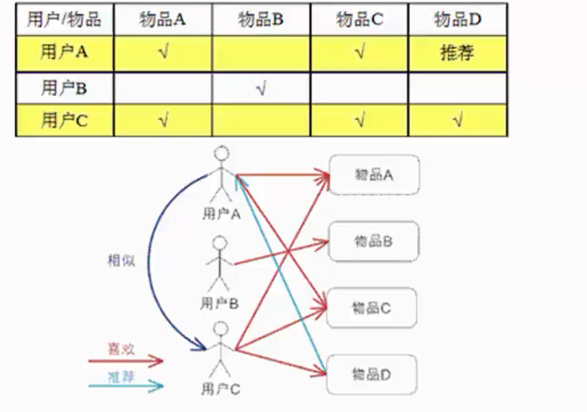
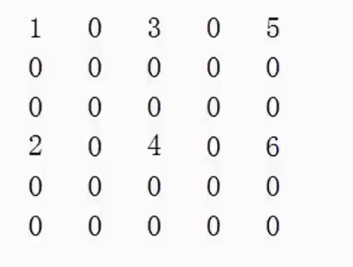

# 基于用户的协同过滤

找到与用户A相似的其他用户，然后看看其他的用户购买了哪些的商品，然后将这些商品推荐给用户A 

## 基于用户的协同过滤需要解决的问题

- 已知用户评分矩阵Matrix R（一般是非常的稀疏的）
- 推断矩阵中空格empty cells处的值,nan的

UserCF存在的问题issues

- 对于一个新用户，很难找到邻居用户
- 对于一个物品，所有最近的邻居都在其上没有多少评分

基础解决方案

- 相似度计算最好使用的是皮尔森相似度
- 考虑共同打分物品的数目，如乘上min(n,N)/N n:共同打分数 N:指定阈值
- 对打分进行归一化的处理
- 设置一个相似度阈值

## 基于用户的协同过滤为啥不流行

1. 稀疏问题
2. 数百万计算
3. 人是善变的

