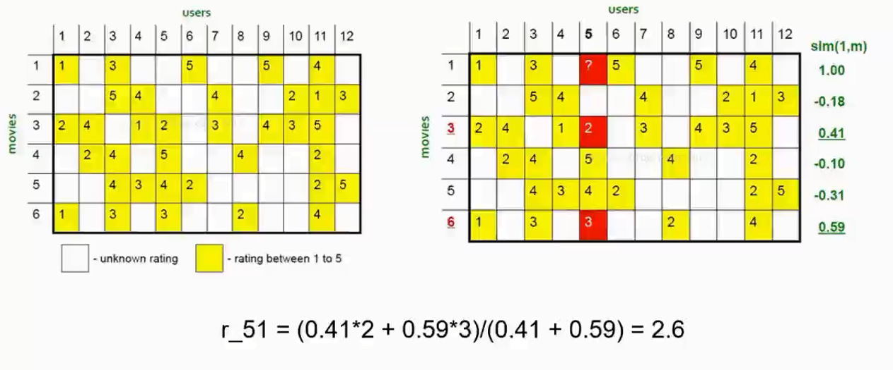
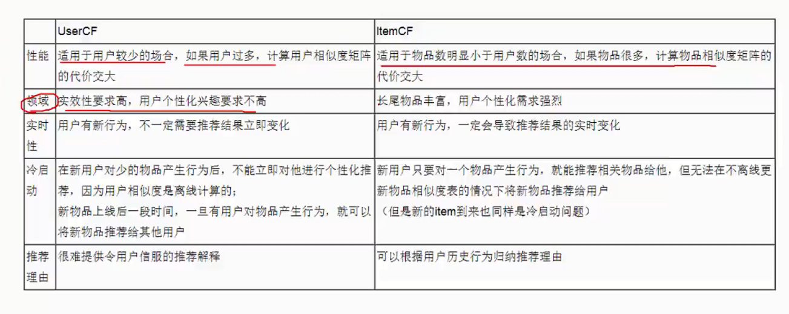

# 基于物品的协同过滤

计算的是物品和物品之间的相似度，这里相似度的计算不是物品的属性之间的相似度，而是物品和用户之间联系的相似度

## 基于物品的协同过滤的优势

- 计算性能高，通常用户的数量远远的大于物品的数量
- 可预先计算保留，物品是无法进行改变的
- 下面的例子是预测的是用户5对于电影1的评分

sim(1,m)：表示的是电影1和其他的电影之间的相似度

## 用户冷启动问题

- 引导用户把自己的一些属性给表达出来
- 利用现有的数据平台
- 根据用户注册属性
- 推荐排行榜单

## 物品冷启动问题

- 文本分析

- 主题模型

- 打标签

  

