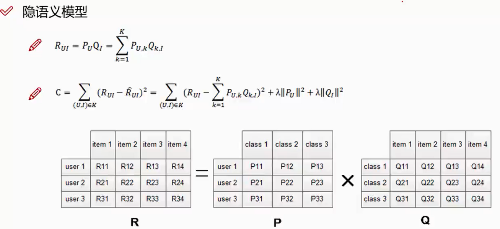
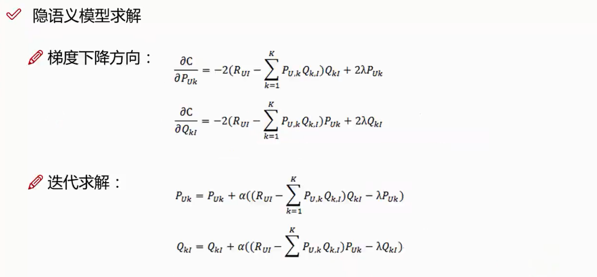
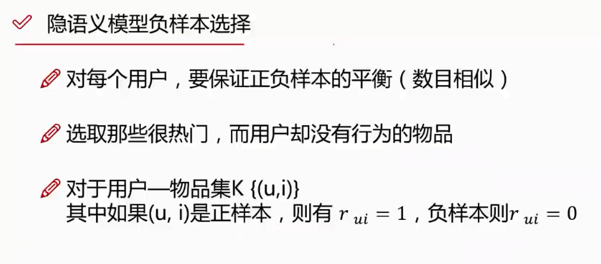
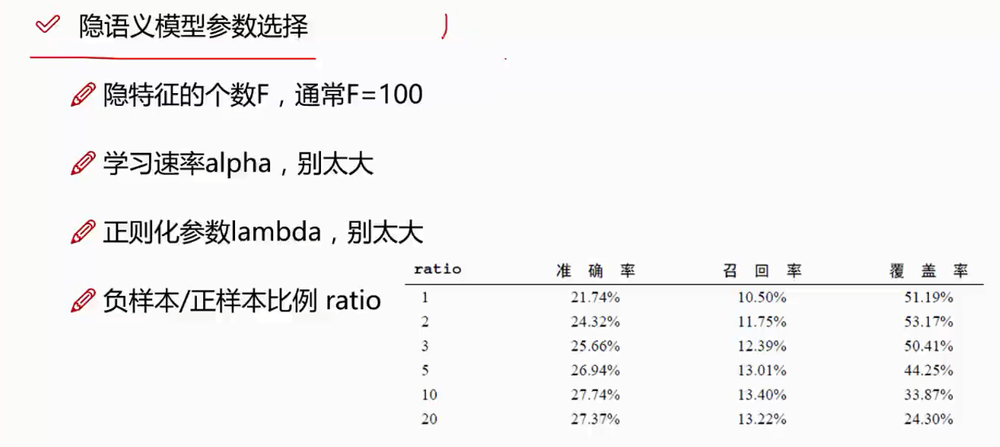

# 隐语义模型

- 从数据出发，进行个性化的推荐
- 用户和物品之间有隐含的联系
- 隐含因子让计算机能理解就好
- 将用户和物品通过中介隐含因子联系起来

N:表示的是有N个用户

M:表示的是有M个商品

隐语义模型是和矩阵的分解是相关的，现在想知道用户和隐含因子之间的关系和电影和隐含因子之间的关系；

现在用户和隐含因子的关系是F×N的矩阵，电影和隐含因子之间的关系是F×M的矩阵

（N×F）  × （ F×M） = N×M的矩阵

隐语义模型的关键在与隐藏因子的寻找

## 隐语义模型的求解

$p_u$:表示的是用户和隐藏因子的关系

$Q_I$:表示的是物品和隐藏因子之间的关系

$C$:表示的是预测值和真实值之间的差异

$\lambda||P_U||^2+\lambda||Q_I||^2$:表示的是正则化惩罚项

